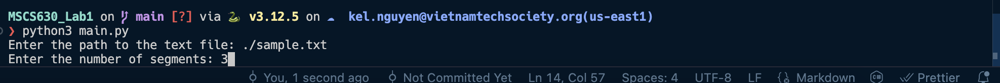
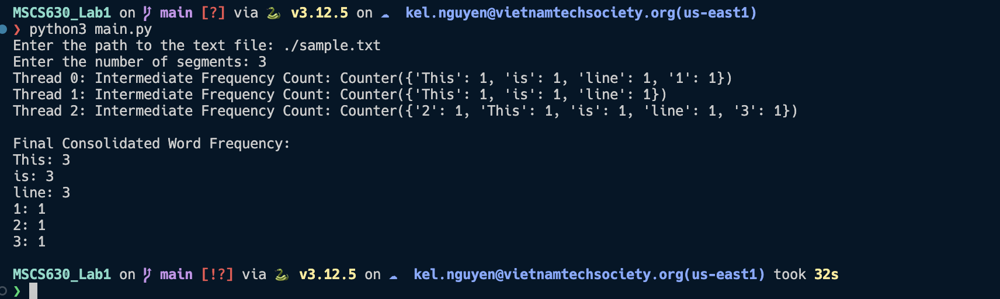

# MSCS630_Lab1
## Setup
- **Step 1:** Download python https://www.python.org/downloads/
- **Step 2:** Download python extension from vsc https://code.visualstudio.com/

## Input
When running with the following command
```
python3 main.py
```
the service will ask for the following two inputs: number of segments and the file path for calculating the word frequency



## Output
After suppling the number of segments and the file path, the final consolidated word frequency output would be
